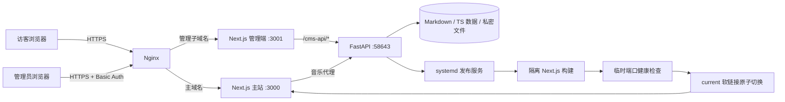
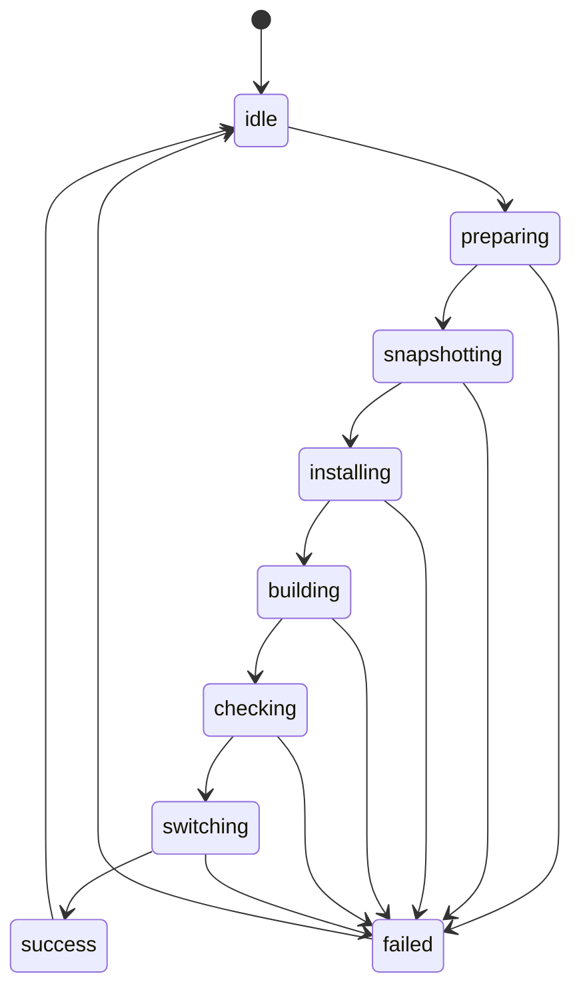

# 前后端架构设计

## 总体结构

## 主站前端

`apps/web` 使用 Next.js App Router、React 19、Tailwind CSS 和 Framer Motion。

- Server Component 读取 Markdown、相册、友链和项目数据，生成可索引页面。
- Client Component 负责主题、音乐播放器、弹幕、动画、访问量和 AI 交互。
- Route Handler 隐藏上游 API 地址，并为音乐、AI、天气和访问量提供同源接口。
- `siteConfig.ts` 是公开展示配置，不允许存放任何服务器密钥。

## 管理前端

`apps/admin` 复用主站页面用于即时预览，并增加：

- 草稿箱和富文本编辑器；
- 个人资料、背景、音乐、图库、评论、AI 和仓库设置；
- 操作队列；
- 构建锁遮罩和 SSE 进度；
- 项目、友链、相册和说说的管理入口。

管理端不直接操作 Git 或 systemd，而是请求 FastAPI。这样浏览器拿不到服务器私钥，也无法绕过后端白名单。

## FastAPI CMS

`apps/admin/cms_core/api` 按资源拆分路由：

| 模块 | 职责 |
| --- | --- |
| `config.py` | 读取和白名单更新 `siteConfig.ts`，单独保存 DeepSeek Key |
| `comments.py` | 自有账号注册、scrypt 密码哈希、GitHub OAuth、会话与 SQLite 评论数据 |
| `drafts.py` | 草稿创建、读取、删除与发布准备 |
| `gallery.py` | 相册数据落盘 |
| `friends.py` | 友链数据落盘 |
| `projects.py` | 项目矩阵落盘 |
| `moments.py` | 说说内容管理 |
| `music.py` | 曲库、缓存、播放地址和歌词 |
| `music_pair.py` | 一次性配对令牌和 Cookie 接收 |
| `deploy.py` | 构建状态、SSE、服务器发布和可选 GitHub 同步 |
| `sync.py` | 管理工作区到主站工作区的受控同步 |

所有写请求都会经过发布锁中间件。构建状态为忙碌时返回 HTTP 423，避免编辑与快照同时修改文件。

## 内容模型

- 长文：Markdown + front matter，位于 `posts/`。
- 杂谈：Markdown + front matter，位于 `chatters/`。
- 说说：Markdown，位于 `moments/`。
- 相册、友链、项目：TypeScript 数组，位于 `data/`。
- 公开设置：`siteConfig.ts`。
- 私密数据：由环境变量指向的服务器文件，不进入仓库。

## 发布状态机

状态写入独立 JSON 文件，管理端使用 SSE 订阅。发布进程重启时，API 会结合进程和状态文件判断是否仍然忙碌，避免短暂断线被误报为构建失败。

## 安全边界

1. 主站域名只公开 3000 的 Nginx 代理。
2. 管理子域名必须启用 HTTPS 和身份认证。
3. 58643 只监听 `127.0.0.1`。
4. DeepSeek Key、音乐 Cookie、SSH 私钥使用权限为 600 的服务器文件。
5. 后端配置更新使用根字段白名单，并阻止服务器 Key 被浏览器自动填入公开字段。
6. 公开仓库不保存真实内容和部署配置。
